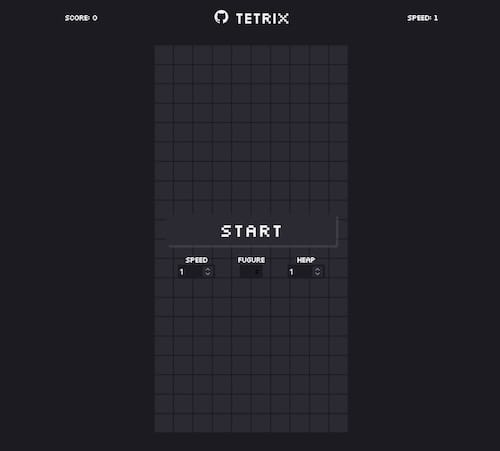
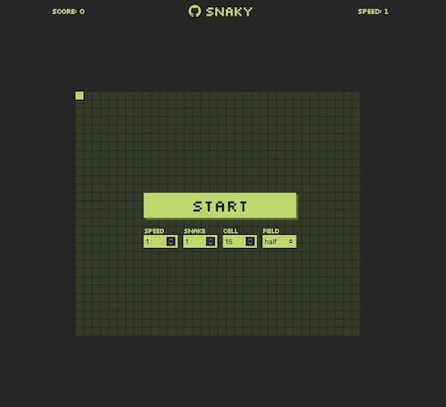
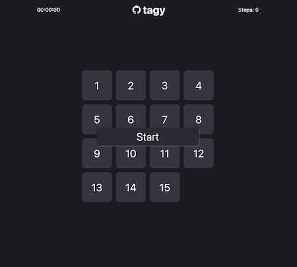
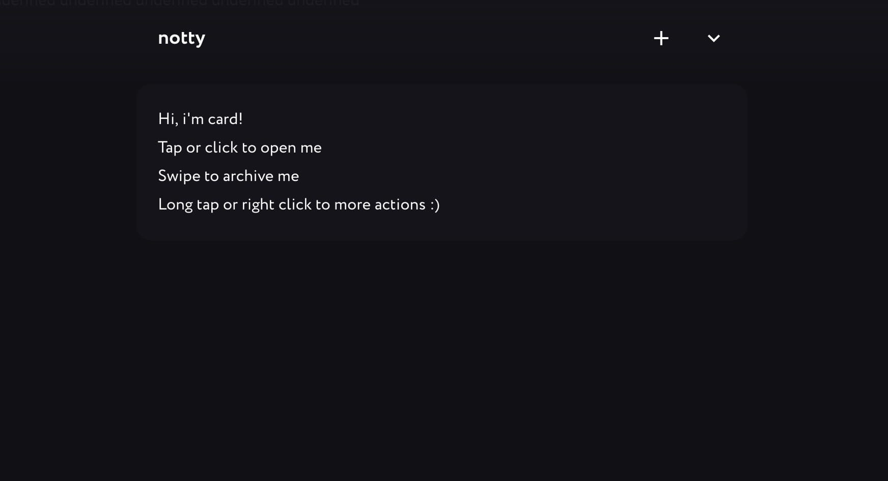
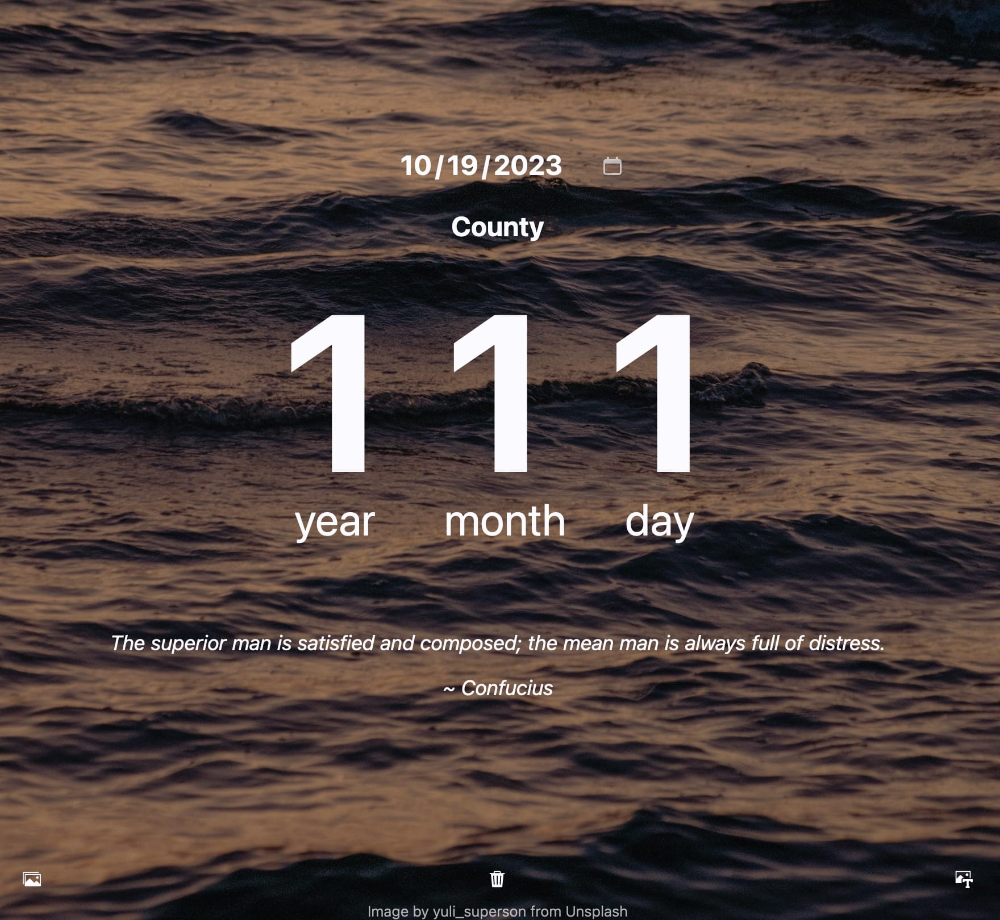
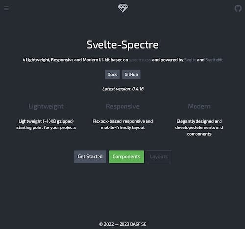

## Work Experience

| Web-dev | **[Dalee/](https://dalee.ru)** | 2025 — present day |
| Senior | Digital production. Russia. | |

- Develop and accompany complex digital products

| Web-dev | **[KnightsOfTheEditingTable](https://knightsoftheeditingtable.com/)** | 2023 — 2024 |
| Senior | Adobe Plugins. Russia. | |

- Set up and automated the development environment as DevOps using Esbuild + nodeJS + Svelte with custom plugins
- To start a new project, just install 1 package and run setup
- Developed a new architecture and data model for plugins
- Created UIKIT and a set of helpers and utilities
- Created 3 new plugins using web stack + Adobe ExtendScript + Svelte
- Migrated 7 plugins to the new architecture and improved their functionality

| Web-dev | **[P2PCloud](https://p2pcloud.io/)** | 2021 — 2023 |
| Middle | Decentralized hosting. California. | |

- Built a promo website
- Developed the GUI for user's personal account
- Wrote the BFF API server to interact GUI with Ethereum contract (backend)
- Wrote and tested a Solidity contract for Ethereum

| Web-dev | **[Metis](https://github.com/basf/metis-gui)** | 2019 — 2021 |
| Middle | BASF Chemical Laboratory. Germany. | |

- Developed [UIKit](https://kit.metis.science/) based on CSS framework spectre.css and js framework Svelte
- Built [GUI](https://github.com/basf/metis-gui) for laboratory calculations
- Created documentation site using SvelteKit + MarkDown

| Designer. Web-dev. | Self-employed | 2015 — 2019 |
| Freelance | | |

- Built and maintained 12 websites for small businesses
- Designed and created 15 logos
- Developed 5 brand styles

| Designer. Web-dev. | **[Aquario](https://aquario.ru)** | 2014 — 2015 |
| | Water supply systems. Russia. | |

- Designed and built an equipment selection calculator interface
- Designed and built the company's corporate website
- Created a printed catalog for new products
- Photographed and prepared photo material for the catalog

| Designer. Web-dev. | | 2001 — 2014 |
| | | |

- [Ministry of Agriculture](https://mcx.gov.ru)
- [Federal State Budgetary Institution "ASP APK"](https://www.fagps.ru)
- Insurance company "RESO-Garantia" (https://reso.ru)
- Insurance company "Continent-Polis"

## Education and Certificates

| Self-taught | | 2001 — present |

## Languages and Technologies

- Languages: HTML, CSS, JS/TS, PHP, Go, Solidity
- Frameworks: Svelte, React, Solid, Vue
- Technologies: NPM, NodeJS, Docker, Git
- Databases: MySQL, Postgres, Mongo, Redis
- Other: Ethereum contracts with Solidity

## Portfolio

- 
- 
- 
- 
- 
- 
